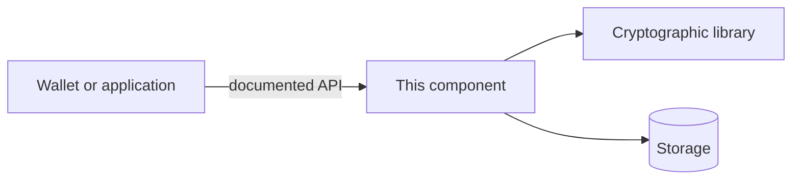

# <Human-readable component name>

<One sentence: who uses this component, what it does, and the outcome it enables.>

**Status:** <Research / Prototype / Pilot / Supported release / Archived>
**Track:** <Identity / Workflow / Witness media provenance / Research>
**Maintainer:** <Verified team or GitHub handle> · **Version:** <release or tested commit>

> <One concrete limitation. State whether this code is suitable for production.>

## What this component does

- <Primary capability supported by this implementation.>
- <Second capability.>
- <Boundary: responsibility of another component, with a link.>

## Architecture



Replace this illustrative diagram with the actual trust boundaries. Describe which
party holds signing keys, which data crosses each boundary, and which operations
require a network connection. Link [architecture](docs/architecture.md),
[protocol specification](docs/protocol.md), and [threat model](docs/threat-model.md)
only after creating those files.

## Prerequisites and compatibility

| Requirement | Supported value / evidence |
|---|---|
| OS / CPU | <tested platforms> |
| Runtime | <exact supported Go / Rust / Python version; omit unused runtimes> |
| Containers | <tested Docker Engine / Compose versions, if used> |
| Kubernetes | <tested cluster + kubectl + Helm versions, if used> |
| Credential formats | <actual VC / SD-JWT / other profiles and versions> |
| Issuance / presentation | <implemented OID4VCI / OID4VP revision and limitations> |
| DID methods | <methods and trust-resolution policy actually supported> |
| Cryptography | <signature/proof suite, curve, library version, setup assumptions> |
| Offline operation | <preloaded trust material, status freshness, supported transports> |

Do not label the implementation eIDAS-certified or universally interoperable without
appropriate evidence. Separate Shamir secret sharing, distributed key generation,
threshold signing and selective disclosure; they solve different problems.

## Run locally

The commands below are a **target harness contract**, not commands already present
in every VIABLE repository. Implement and test them, or replace them with the actual
commands. Delete this explanation once the instructions are verified.

```sh
git clone https://github.com/VIABLE-hub/<repository>.git
cd <repository>
cp .env.example .env
# Generate fresh local test keys using the documented command.
make dev-keys
docker compose -f compose.dev.yaml up --build
make smoke-test
```

Expected result: <service URL, successful response, and location of synthetic demo>.
Document occupied ports, CPU/RAM, storage, first-run time and cleanup. Bind development
services to loopback by default. Never embed production keys or real credential data.

### Kubernetes development harness — optional

Remove this section if no Kubernetes harness exists. It is not a production runbook.

```sh
kubectl config current-context
# Confirm this is your dedicated local development cluster.
helm upgrade --install viable-dev ./deploy/helm \
  --namespace viable-dev --create-namespace \
  --values deploy/helm/values.dev.yaml --wait
kubectl -n viable-dev get pods
```

Document how fresh keys are supplied, how synthetic fixtures are loaded and how the
namespace is cleaned up. Do not use a shared or production cluster for these commands.

## API and SDK usage

Choose the implemented interface; remove the other examples. Do not imply REST or
gRPC exists simply because this template includes both.

```sh
# Replace route and fixture with actual implemented examples.
curl --fail http://127.0.0.1:<port>/<actual-route> \
  -H 'Content-Type: application/json' \
  --data @examples/<synthetic-request>.json
```

```sh
# Local development only; production transport/auth must be documented separately.
grpcurl -plaintext -import-path api/proto -proto service.proto \
  -d @ 127.0.0.1:<port> <package.Service/Method> \
  < examples/<synthetic-request>.json
```

Include one small expected response and one failure response. Explain authentication,
timeouts, replay protection, error codes and API compatibility. Link the actual
OpenAPI/protobuf files and supported SDK versions. Use synthetic payloads only.

## Tests and reproducibility

```sh
# Replace with actual, verified repository commands.
make lint
make test
make integration-test
```

Record the tested commit, toolchain, fixture version and hardware. For ZK/crypto:
include positive and negative vectors, malformed input, replay/nonce behavior,
parameter provenance and protocol-specific threshold/failure cases. Report proof
size, verification latency and memory with methodology and uncertainty; do not
present one machine's microbenchmark as pilot throughput.

## Deployment and operations

Link the real deployment runbook. Describe health/readiness, metrics, logging without
sensitive claims, key rotation, migrations, rollback and recovery. State which
operations require online trust/status refresh. List supported versions and ownership.

## Security

Read [SECURITY.md](SECURITY.md). Never disclose keys or personal credential data in
public issues. List security review status and unresolved limitations candidly.

## Contributing and roadmap

Read [CONTRIBUTING.md](CONTRIBUTING.md). Link scoped issues or the authorized project
board. Explain how to run checks and which changes require design/cryptography review.

## License, attribution and research

<Exact license and link to LICENSE; preserve original copyright and NOTICE files.>
<For proprietary code, state the approved terms; do not invent a license grant.>
<Original upstream + source revision + modifications, if imported.>
<Paper/DOI and CITATION.cff, when this is a research artifact.>
